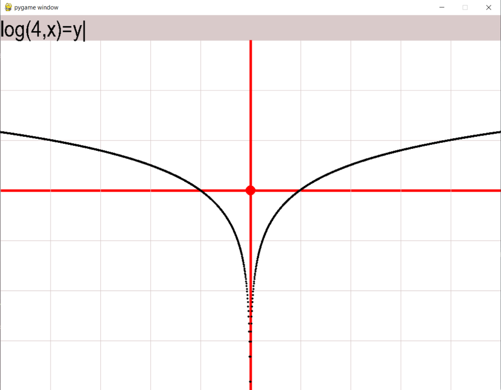

<pre>
<h1>РУС</h1>
<h4>Построение Графиков</h4> 
Программа позволяет строить графики по формуле.
        <h3>Важно!!!</h3>С одной части уравнения из переменных может быть только x, переменная может повтряться сколько угодно раз, а в другой части уравнения только y, причём единожды.

<h3>Пользование:</h3>
Для ввода формулы просто пишите текст, после нажимайте Enter для ввода.
Для того чтобы посмотреть текущие координаты курсора, кликните правой кнопкой мыши, координаты целые или нет - переключение левой кнопкой.
Для изменения масштаба испоьзуйте колёсико мыши.

<h1>ENG</h1>
<h4>Draw Graphs</h4>
This program draw graphs by function (equation).
        <h3>Attention!!!</h3>Variable can be only x in first part of equation and variable canrepeated any number of times. Variable can be only y in second part and it's can't repeated.

<h3>Using:</h3>
Write text on keyword and press Enter for draw function's graph.
If you want to watch cooordinates of mouse cursor, you would click RigthMouseButton. If you want to watch coordinates in integers, than you would click LeftMouseButton.
Use mouse wheel for change scale.

</pre>
