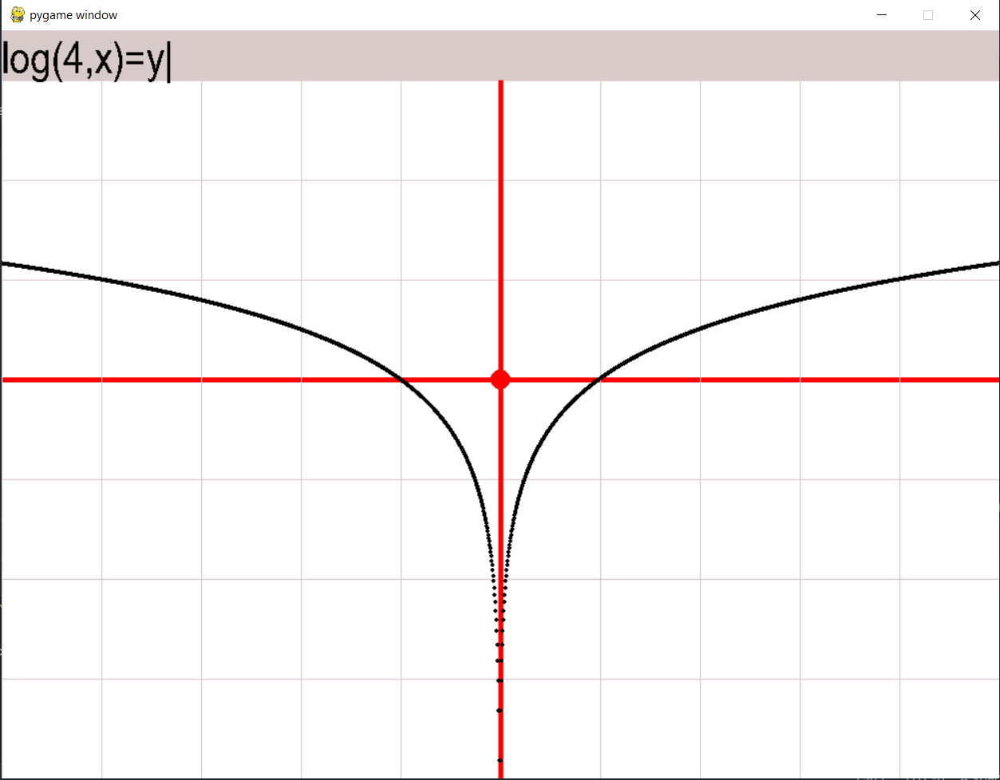

<pre>
<h1>РУС</h1>
<h4>Построение Графиков</h4> 
Программа позволяет строить графики по формуле.
        <h3>Важно!!!</h3>Переменная y может быть только в одной части уравнения и только в первой степени. Также программа может работать неверно в некоторых уравнениях с модулем.

<h3>Использование:</h3>
Для ввода формулы просто пишите текст, после нажимайте Enter для ввода.
Для того чтобы посмотреть текущие координаты курсора, кликните правой кнопкой мыши, координаты целые или нет - переключение левой кнопкой.
Для изменения масштаба испоьзуйте колёсико мыши.

<h1>ENG</h1>
<h4>Draw Graphs</h4>
This program draw graphs by function (equation).
        <h3>Attention!!!</h3>Variable y can be only in one side of equation and only in first power. Too program can be wrong in any equations with modul. 

<h3>Using:</h3>
Write text on keyword and press Enter for draw function's graph.
If you want to watch cooordinates of mouse cursor, you would click RigthMouseButton. If you want to watch coordinates in integers, than you would click LeftMouseButton.
Use mouse wheel for change scale.

</pre>
